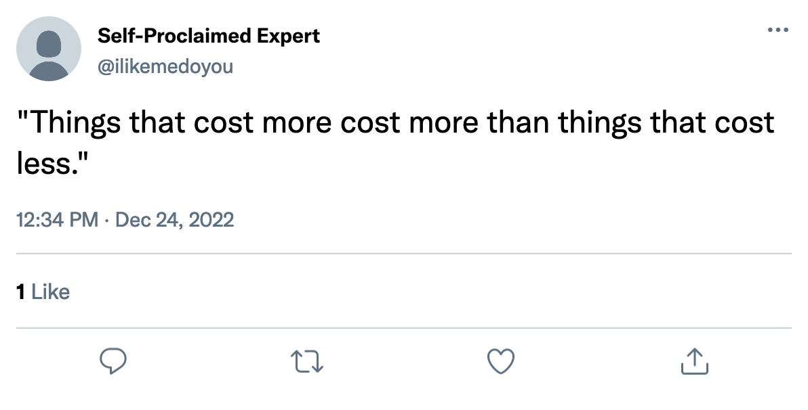

# Why pay many money when few money do trick?

You want to automate stuff? Great! Buy our courses [here](https://robocorp.com/docs/courses). Buy a developer tool license [here](https://robocorp.com/download). Need infra for running the bot? Buy [here](https://id.robocorp.com/signup).

What do you mean you can't pay?

Oh no... It can not be. Everything's _free_? 😱

_faints_

Wakey wakey, rise and shine! You ok? While you were out, we were able to verify that, indeed, the stuff is free!

_faints_

Sigh.

Hello? Feeling fine? Listen. Take a deep breath. Our team did some digging and... You won't believe it, but: If you really want, you _can_ pay! Yes, I'm so happy for you! 😀

So, you mentioned you are looking to run your bots on Windows machines and would like to buy a server room filled with machines humming 24/7? Lemme check.

Unfortunately, I was only able to find these auto-scaling environments that are up only when you need them. We also seem to support running multiple accounts and bots on a single machine. The cost will be less than you expect. So sorry. If you want, you can maybe donate that leftover money to find homes for orphaned Windows servers?

I'll let you know if we can find something more expensive. See you and happy automation!
